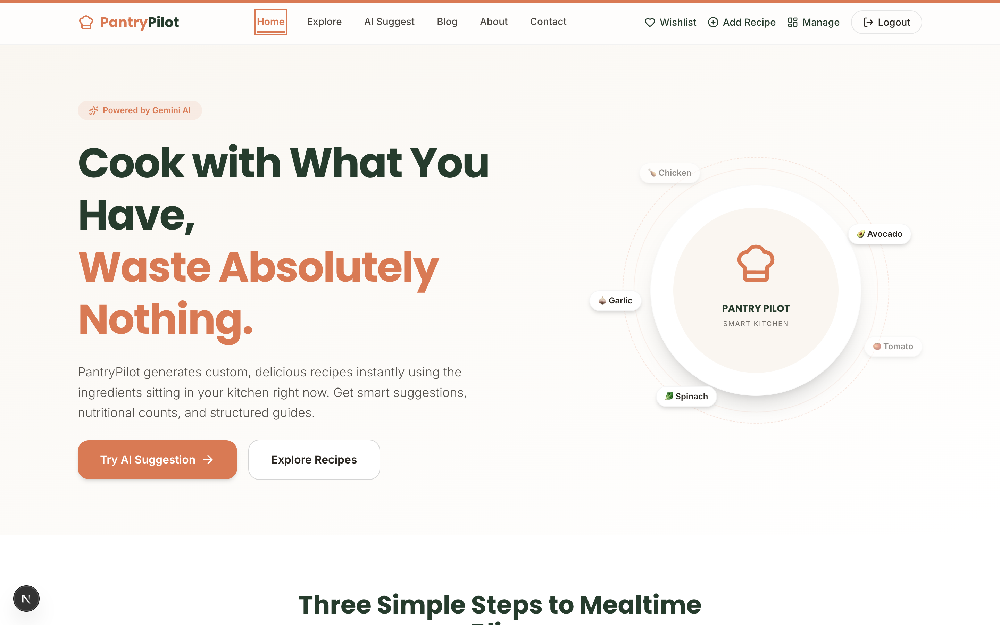
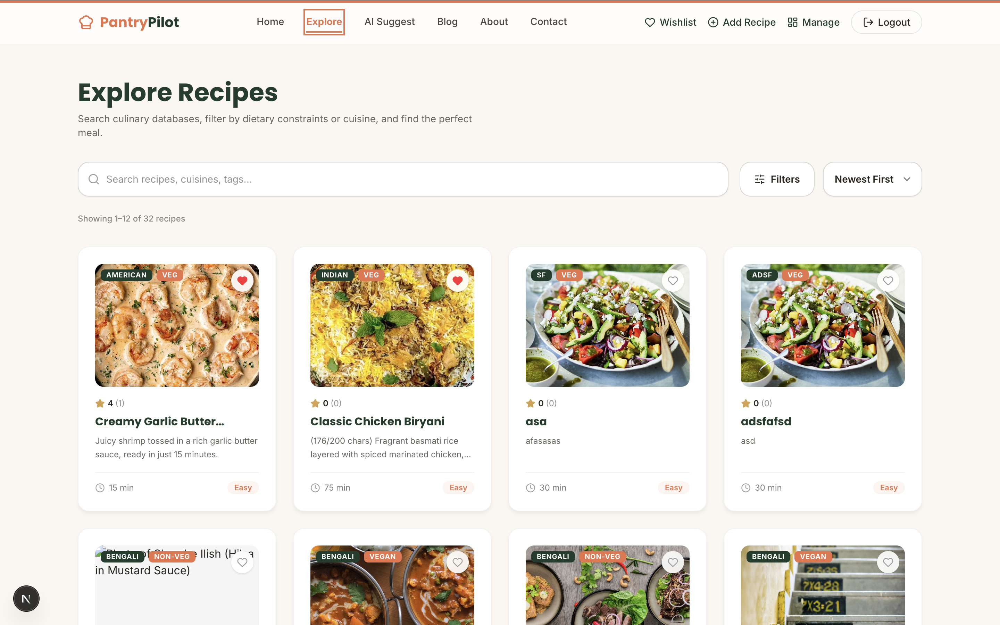
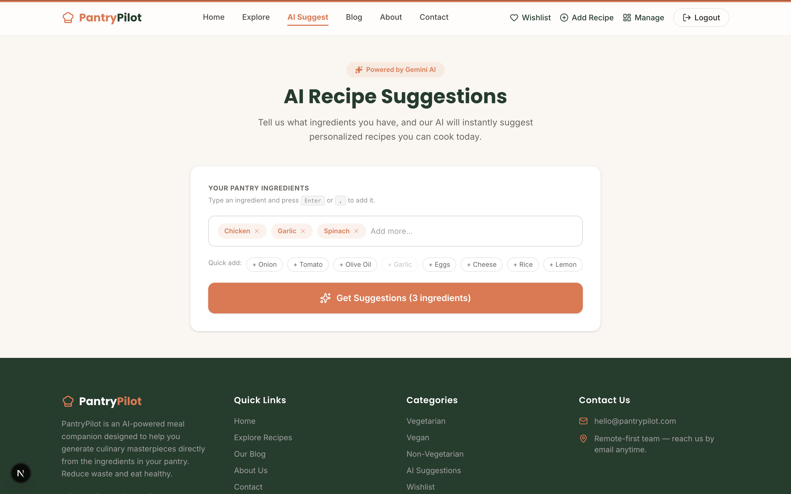

# 🍳 PantryPilot

**PantryPilot** is a full-stack, AI-powered recipe platform where users can explore recipes, get smart ingredient-based suggestions from Google Gemini, manage their own recipes and blog posts, save favorites to a wishlist, and rate/review dishes — all wrapped in a clean, responsive UI.

🔗 **Live Site:** [https://pantrypilot-client.vercel.app](https://pantrypilot-client.vercel.app)
🔗 **Backend API:** [https://pantrypilot-server.vercel.app](https://pantrypilot-server.vercel.app)
📦 **Frontend Repo:** [github.com/azizul-dev/pantrypilot-client](https://github.com/azizul-dev/pantrypilot-client)
📦 **Backend Repo:** [github.com/azizul-dev/pantrypilot-server](https://github.com/azizul-dev/pantrypilot-server)

---

## 📸 Screenshots

| Home Page | Explore Page | AI Suggest Page |
|:---:|:---:|:---:|
|  |  |  |

---

## ✨ Features

### 🏠 Home Page
- 10 fully modular sections: Hero, How It Works, Featured Recipes (real data + hover-swap images), AI Teaser, Categories, Testimonials, Stats, Newsletter, FAQ, and CTA Banner.

### 🔍 Explore / Browse Recipes
- Live search, filtering by cuisine, diet type, and max cook time
- Sorting by newest, top rated, and cook time
- Server-side pagination
- Skeleton loaders while fetching
- Hover-to-swap image previews
- One-click wishlist toggling

### 📖 Recipe Details
- Full description, ingredients, and step-by-step instructions
- Real ratings & reviews from users
- Related recipes
- Wishlist toggle

### 🤖 AI Features (Google Gemini)
1. **AI Recipe Suggester (dual-mode)** — enter a list of ingredients to get a pantry-match score, missing ingredients, and recipes you can make; or ask a natural-language question about a dish (e.g. *"what is needed to cook chicken biryani?"*) and get a full ingredient breakdown with contextual reasoning.
2. **AI Recipe Description Generator** — generates polished recipe descriptions from structured input, with adjustable output length and a regenerate option.

### ❤️ Wishlist
- Save/unsave any recipe from the Explore, Details, or Home pages
- Dedicated "My Wishlist" page

### ✍️ Blog
- Browse cooking tips and stories with a debounced search bar
- Featured hero card layout for the latest post
- Full blog detail pages with author, date, and read time
- Any logged-in user can write and publish a post

### 🔐 Authentication
- Email/password registration & login with JWT
- Google Social Login (NextAuth)
- Demo login with one-click auto-fill credentials
- Protected routes (Add Recipe, Manage Recipes) redirect unauthenticated users to `/login`

### 🧑‍🍳 Recipe Management
- **Add Recipe** (`/items/add`) — multi-image input, cuisine/diet/cook-time fields, full validation
- **Manage Recipes** (`/items/manage`) — view and delete your own recipes, server-side pagination

### 📄 Additional Pages
- About, Contact, and Blog

---

## 🛠 Tech Stack

### Frontend
| Tech | Purpose |
|---|---|
| Next.js (App Router) + TypeScript | Framework |
| Tailwind CSS | Styling |
| Framer Motion | Animation |
| TanStack Query | Server-state / data fetching |
| Axios | HTTP client |
| NextAuth | Authentication (Credentials + Google) |

### Backend
| Tech | Purpose |
|---|---|
| Node.js + Express + TypeScript | REST API |
| MongoDB Atlas + Mongoose | Database |
| JWT + bcrypt | Backend authentication |
| Google Gemini API (`@google/generative-ai`) | AI features |

### Deployment
Both frontend and backend are deployed on **Vercel** as serverless functions.

---

## 📁 Project Structure

```
pantrypilot-client/     # Next.js frontend
  src/
  ├── app/               # Pages (App Router)
  ├── components/        # Reusable & home-page section components
  ├── hooks/              # useAuth, useWishlist
  └── types/              # Shared TypeScript types

pantrypilot-server/     # Express backend
  src/
  ├── routes/            # Route definitions
  ├── controllers/       # Request handlers
  ├── services/           # Business logic
  ├── models/             # Mongoose schemas
  └── config/             # Env constants, DB connection
  api/
  └── index.ts            # Vercel serverless entry point
```

---

## ⚙️ Environment Variables

### Backend (`pantrypilot-server`)
```
MONGODB_URI=
JWT_SECRET=
GEMINI_API_KEY=
FRONTEND_ORIGIN=http://localhost:3000,https://pantrypilot-client.vercel.app
NODE_ENV=production
```

### Frontend (`pantrypilot-client`)
```
NEXT_PUBLIC_API_URL=https://pantrypilot-server.vercel.app/api
NEXTAUTH_SECRET=
NEXTAUTH_URL=https://pantrypilot-client.vercel.app
GOOGLE_CLIENT_ID=
GOOGLE_CLIENT_SECRET=
```

---

## 🚀 Running Locally

### Backend
```bash
cd pantrypilot-server
npm install
npm run dev      # http://localhost:8000
```

### Frontend
```bash
cd pantrypilot-client
npm install
npm run dev       # http://localhost:3000
```

Make sure both `.env` files above are filled in before starting either server.

---

## 📜 License

MIT